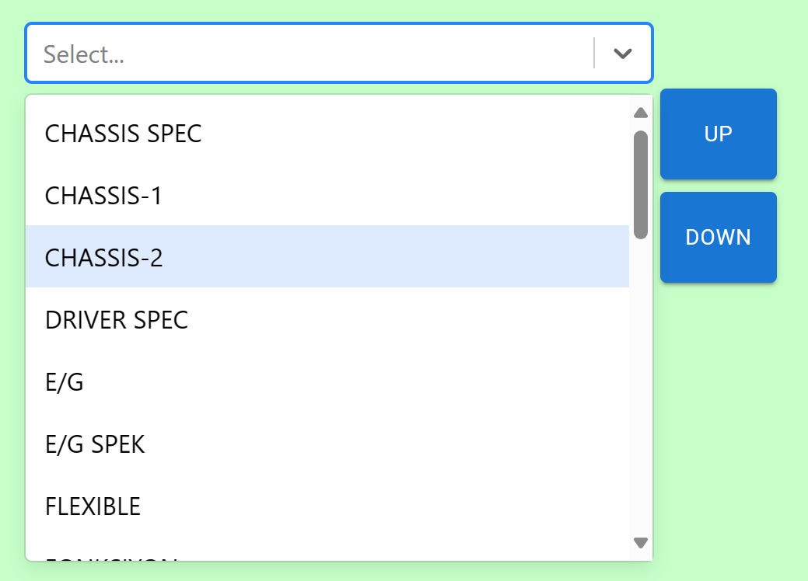
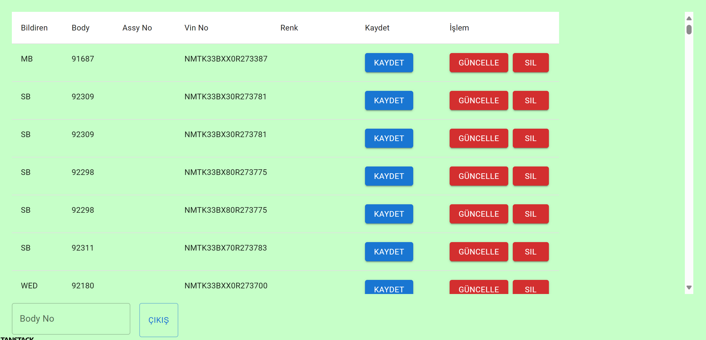

# Toyota Frontend React Project

This project is developed for 32Bit's Toyota frontend developer contest. The purpose of this application is to list factory terminals, list faults and be able to enter faults specifying a location on image.

## Technical Decisions

While developing this application I tried my best to use the most up-to-date standard tools preferred by developers and enterprises.

### Typescript

By utilizing Typescript, I believe that the DX (Developer Experience) will be improved by a big margin. Typescript is supported by a lot of libraries which will let the IDE to suggest autocomplete almost everywhere in our code as if we are developing in a statically typed language. Which will improve DX and reduce development times.

### Tanstack Router for Routing

I choose Tanstack router because of it's flexibility, first class typescript support, easy to use API and the clean project structure that it permits.

### MSWJS.io

Mock Service Worker is an API mocking library that allows us to write client-agnostic mocks and reuse them across any environments. It works by intercepting http request in Browser's service worker. Using Mock service worker we are able to mock api without adding any adapters in our code. and without having to create a mock database in our environment.

### Other

- **react-query** for state management.
- **react-select** for our custom select component.

- **react-hook-form**
- **react-table** and **react-virtual** for faults page.

- **Axios**

## Roadmap

- [ ] Add i18n
- [ ] Add virtual keyboard

## Acknowledgments

Thanks to [@TannerLinsley](https://twitter.com/tannerlinsley) for his contributions to the React community, including his outstanding libraries and educational resources that have greatly empowered me to build better React applications.